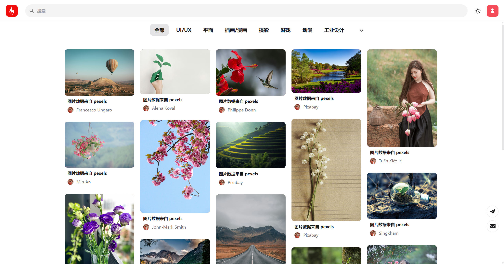
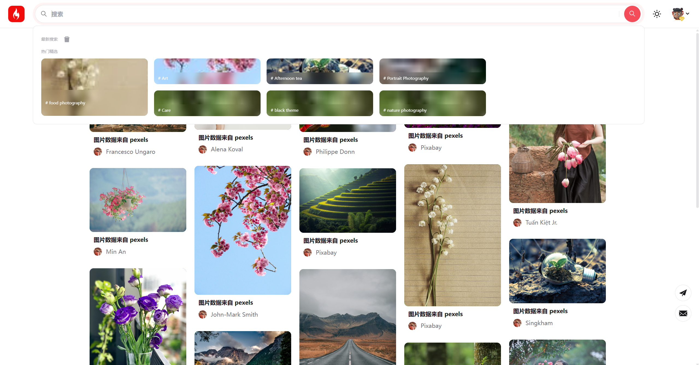
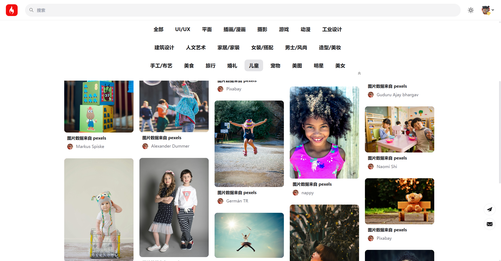
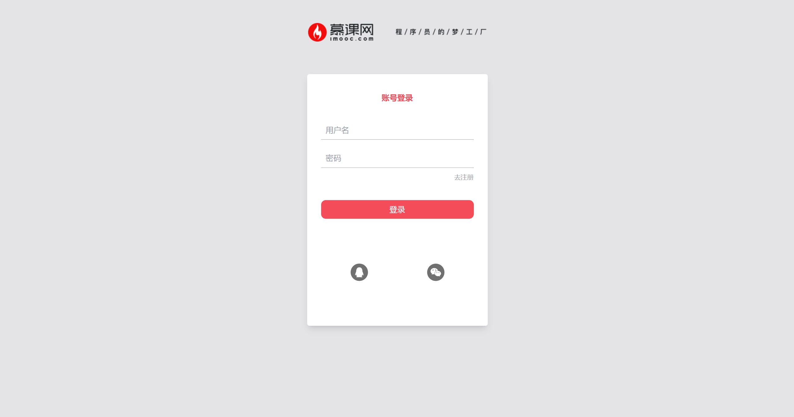

# [English](README.en.md) [中文](README.md)

## 小慕前端 (imooc-front)

这是一个基于 Vue 3、Vite 和 Tailwind CSS 构建的前端项目，灵感来源于 Pinterest，旨在提供一个图片展示和分享的平台。图片数据直接从 Pexels 获取，并且提供后端 MOCK 接口，使您无需后端程序就可以启动项目。

## ✨ 功能特性

- **图片展示**: 瀑布流布局展示图片列表。
- **图片搜索**: 支持关键词搜索 Pexels 图片。
- **图片详情**: 查看单张图片的详细信息和相关推荐。
- **用户系统**:
  - 注册与登录 (支持 QQ、微信第三方登录)。
  - 个人中心 (信息修改、头像更换)。
- **主题切换**: 支持浅色、深色模式切换。
- **VIP 功能**: (可选) 付费会员功能。
- **响应式设计**: 适配 PC 和移动端。
- **消息提示**: 提供用户操作反馈。
- **无限滚动**: 瀑布流图片无限加载。
- **引导功能**: 新用户功能引导。

## 🛠️ 技术栈

- **框架**: Vue 3
- **构建工具**: Vite 2.8+
- **UI 库**: Tailwind CSS 3.0+
- **状态管理**: Vuex
- **路由**: Vue Router
- **HTTP 请求**: Axios

## ⚙️ 运行环境

- Node.js >= 16.13.1
- npm >= 8.1.2

## 🚀 快速开始

1.  **克隆项目**

    ```bash
    git clone https://github.com/toypipi/imooc-front.git
    cd imooc-front
    ```

2.  **安装依赖**

    ```bash
    npm install
    ```

    _如果遇到 `node-sass` 或 `sass-loader` 相关安装问题，请尝试使用 `cnpm` 或配置 `npm` 镜像源。_

3.  **运行开发环境**

    ```bash
    npm run dev
    ```

    项目将在 `http://localhost:xxxx` 启动 (具体端口号见终端输出)。

4.  **启动后端 MOCK 接口**

    ```bash
    node server.js
    ```

    项目将在 `http://localhost:3001` 启动。

5.  **构建生产包**
    ```bash
    npm run build
    ```
    构建后的文件位于 `dist` 目录。

## 📸 项目截图







## ❤️ 支持项目

如果觉得框架不错，或者已经在使用了，希望您可以给项目一个 ⭐ Star，这将是对我极大的鼓励与支持。

或者，也可以请我喝杯咖啡 🤭：

|                 微信                 |               支付宝                |
| :----------------------------------: | :---------------------------------: |
|  |  |

您的支持是项目持续发展的动力！

## 🤝 贡献

欢迎提交 Pull Request 或 Issue.
